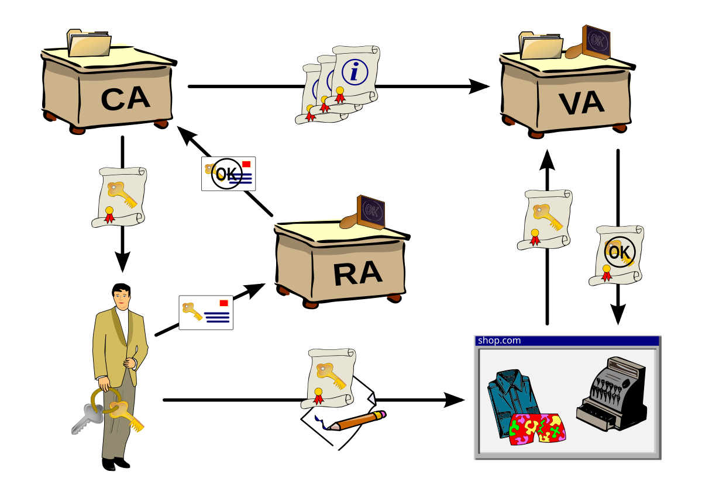
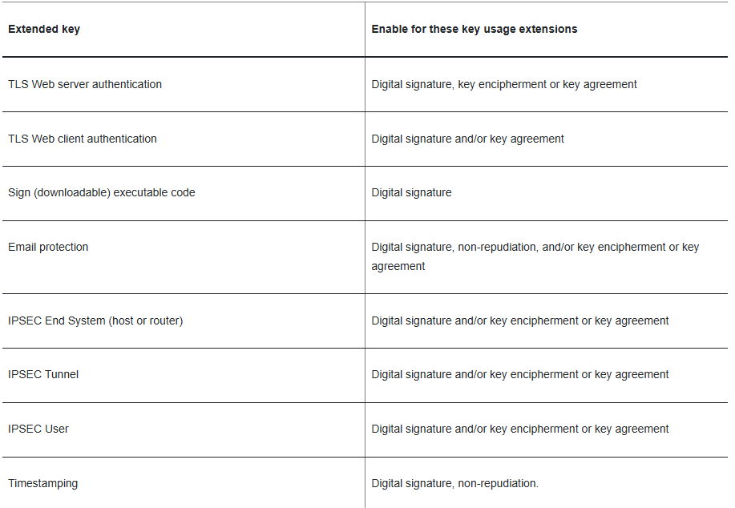
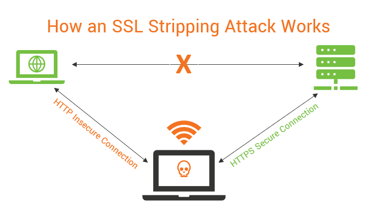

## Encryption
- What is encryption? (an algorithm used to transform data so that only authorized parties may be able to see it)
- What are the uses of encryption? (protect data from being stolen or changed)
- How does encryption protect the data? Why can't I just reverse the algorithm? (There is a use of a secret key that is known only by select parties)
- If I wanted to break a strong encryption, What would I need to do? (brute force the key)
- What are some examples of encryptions? Which one is the one we prefer using today? What reasons are there for it being strong? (AES, DES, RC4. AES is currently considered the standard, their strength comes from their key size and the amount of cycles)
- What is the disadvantage for to large a key size? What about the number of cycles? (slower)
- Why is the XOR cipher weak? (only one plaintext to break + you can guess parts of the key at a time)
- What are some real life scenarios where you use encryption? (Whatsapp, browsing, Ubbi dubbi)
- What types of encryption are there? (Symmetric, A-Symmetric)
- Compare symmetric and a-symmetric encryption
	- Keys used
	- Speed
	- Security
	- Key distribution
	- Uses (encrypt data in database or file, digital signatures)
	- Examples (Kerberos, LDAP/TLS, Whats App)
	- Algorithms (RSA, ECC, AES, DES, RC4)
- How is symmetric encryption used with a-symmetric encryption? (agree on secret)
- What is bit strength? 
- What mathematical principal does A-Symmetric encryption rely on? (integer factorization)
## Hash
- What is a hashing function? (fixed size output, deterministic)
- What are its uses? (password storage, data signature, checksum, key derivation, blockchains)
- What important properties does it have? (one way, collision resistant, uniform, avalanche)
- What does it mean if there is a hash collision? Can two different passwords work?
- What are some examples of hashing algorithms? (SHA256, MD4)
- Lets say I found the password hash for a user, how would I go about breaking it? What mitigates this threat? (rainbow table, salt)
- What is the difference between a hash function and an encryption? (use cases, hash is irreversible)
- $\color{blue}\text{Not Needed}$ What is the difference between a hash function and an HMAC? (HMAC uses a secret key as well)
#### Digital signature
- What is a digital signature? (combination of hash and encryption for integrity, authenticity. Equivalent of actual signatures)
- Examples (documents, certificates, software, block chains)
- Should we event do this?
## TLS
[TLS](<Transport Layer Security>)
- What is it? (protocol used to transfer data securely)
- How many versions are there? What came before it?
- $\color{blue}\text{Not Needed}$ What is the difference between TLS 1.2 and TLS 1.1?
- Explain the TLS protocol in detail
- What is a cipher suite? What does each part mean? 
- Why do you need a client and server random? (protect from replay attacks)
- What is elliptic curve cryptography? (same principals, harder to reverse)
- What is mutual TLS? What does it add to the current protocol?
- $\color{red}\text{Bonus:}$ What are the protocol extensions in the client hello?
- If the server has a private / public pair, then why even use TLS? Why not just use the servers public key?
## Rivest Shamir Adleman
- $\color{Blue}\text{Not Needed}$ What does the abbreviation stand for?
	- What is the nationalism of Shamir?
- How does it work?
## Diffie Hellman
- What is it used for?
- How does it work?
- $\color{Red}\text{Bonus}$ What is the discrete logarithm problem?
## Public Key Infrastructure
- What is a PKI? (entities, roles, policies and software to allow the use of certificates and public key cryptography)
- $\color{blue}\text{Not  Needed}$ Who are the entities of a PKI infrastructure? (registration authority, certification authority, certificate distribution point, OSCP endpoint) 
## Certificates
- What is it? (electronic document used to prove identity)
- Give some examples for certificate uses (email, digital signature, TLS)
- Where are certificates stored in a windows machine? What types of store are there? (certificate store, user, machine)
	- If I need to change a certificate for a web server, what certificate store will I access?
- How can you view machine certificates, How can you view user certificates? (certlm.msc, certmgr.msc)
- How can you add a certificate to the certificate store? (Install certificate)
- What is a self signed certificate? How can you trust it?
- How can you distribute certificates in a domain environment? (GPO)
- $\color{Red}\text{Bonus}$ What are wildcard certificates? (uses asterisk in domain name)
- How can you save a certificate?
	- CSR - Certificate signing request
	- CRL - Certificate revocation list
	- CERT, CRT, CER, DER - PEM or DER encoded certificate
	- PKCS12, PFX, P12 - Holds certificates with private key, protected by password.
	- PEM - Encoding of certificates, may have private key
	- KEY - Holds PEM encoded private key
- What are certificate templates? (predefined structure used to create certificates)
- Can you create certificate templates?
- What are the certificate validation types? $\color{blue}\text{Not Needed}$ How do you know the extended verification of a certificate? (based on the certificate policies extension)
	- Domain validation - CA confirms ownership of the domain name
	- Organization validation - CA also confirms the business is registered
	- Enterprise validation - 9 rigorous steps of validation - was previously given a green highlight in a browser
- If the certificate is sent during the TLS handshake, what's stopping me from stealing it? What doesn't the certificate contain? Where is the private key saved? What happens if someone finds it?
- $\color{blue}\text{Not Needed}$ Can you trust a certificate from the future?
#### Certificate Revocation List
- What is a CRL? Who publishes it?
- How can we know a CRL hasn't been changed? (It is signed)
- What are some examples of fields of the CRL? (effective date, next update)
- What is a CRL cache? Why does it exist?
###### Online Certificate Status Protocol
- What is the OCSP protocol? (over http, gets status of certificate)
- $\color{blue}\text{Not Needed}$ Where is the OCSP URI saved? (Authority Information Access)
- $\color{blue}\text{Not Needed}$ What OCSP stapling? (Server gets OCSP response with a timestamp and staples it to the message sent back to the client)
	- What is the advantage of OCSP over a CRL?
- Which would you like to use, OCSP or CRLs? (CRLs don't expose what sites client access, they provide less workload, and OCSP is over plain http)
- $\color{blue}\text{Not Needed}$ Is OCSP still supported?
#### Chain of trust
- What is a chain of trust? What would happen without it?
	- What's stopping us from issuing a certificate in the name of google and impersonating them?
- What are intermediate CAs? What are root CAs? Who signs the certificates of each one?
- You got a new computer, how is it that you trust googles certificate?
- Why is there intermediate and root CAs? Why not only root CAs? (revoke is easier, intermediate is accessible over the network)
- Where do you think our root CA is located?
#### Certificate fields
- What is the X.509 format? (set of extensions for certificates, CSR's, CRL's)
- What is a serial number? Is it unique? What is a thumbprint? What's the difference?
- $\color{blue}\text{Not Needed}$ What is the thumbprint used for? What other name for it is there? (Identifying the certificate, fingerprint)
- What is the signature algorithm? (hash plus encryption used for signing the certificate)
- What is a CDP? (CRL distribution point, the endpoint to get the CRL)
- What is the expiration time of a certificate? What is the start time?
- What is the Issuer and subject fields? How do they look? (look like a common name)
	- Is the subject field actually used?
- What is the SAN field? What does it stand for? What can be a part of it? (Email, DNS, IP, URI)
	- What is the SAN field used for? (verify domain name)
	- What is the difference between the subject field and the SAN? (SAN can hold multiple values, SAN is actually useful)
- What is the key usage and extended key usage fields? Why do they exist? (minimize damage if certificate is compromised)
	- Give some examples of key usages
		- digital signature
		- data encipherment
		- certificate signing
		- key agreement
	- Give some examples of extended key usages
		- server authentication
		- client authentication
		- code signing
		- email protection
- What is the difference between key usage and EKU? (EKU is more fine grained)
- $\color{blue}\text{Not Needed}$ What is the relationship between key usages and EKU? 
- Can you start a TLS session with a server that doesn't have the server authentication EKU? (no, unless its critical)
- $\color{blue}\text{Not Needed}$ How are key usages and extended key usages identified? (OID)
## OpenSSL and Certutil
- What is OpenSSL? Give some examples of things it can do
	- It is an open source cryptographic library. It can provide TLS implementation, encryption algorithm and hash implementations, key generation, creating certificates and more
- What is Certutil? (same)
- What is the difference? (Linux vs Windows)
## TLS attacks
- What is SSL stripping? 
- What is heart bleed?
## Extra
- What is the zero trust approach?
- What is a zero knowledge proof?
- Quantum computers - break TLS
- What component of windows handles secure communications? (SSPI's Schannel)